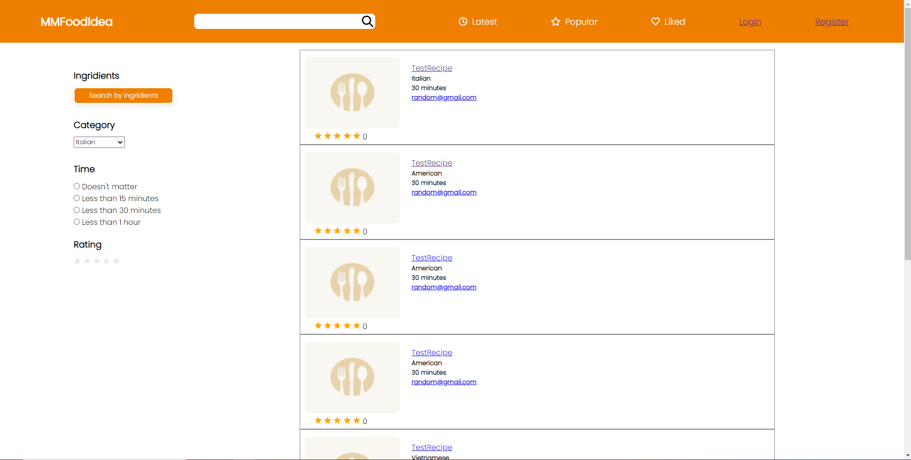
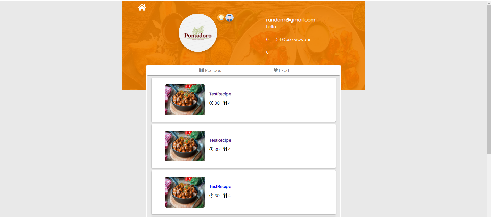

# MMFoodIdea - site with recipes and some cool features

Simple and minimalistic site with recipes. Users can post their own recipes. The recipes can be commented, rated, liked. There are many filters for users to be able to find recipes quickly. There is also an ingridient search that allows you to find recipe that you can make with the ingridients you have at home.

## Table of contents

* [Assumptions](#assumptions)
* [Technologies](#technologies)
* [Screenshots](#screenshots)
* [Status](#status)

## Assumptions

## Technologies
* C#
* MVC
* EF Core
* Microsoft SQL Server
* HTML5
* CSS
* JavaScript ES6
* Ajax

## Screenshots

## Status

Abandoned - To be resumed
